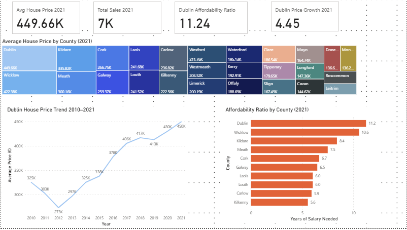
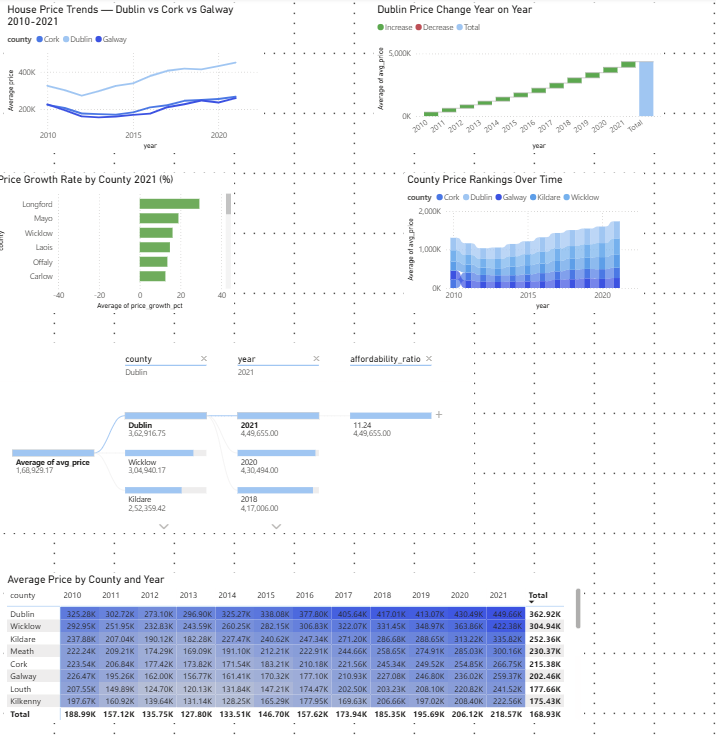

# Irish Housing Market Analysis 2010–2021

**Author:** Ramya  
**LinkedIn:** www.linkedin.com/in/ramyacn
**Email:** ramyacnanjappa@gmail.com

---

## Project Overview
End-to-end data analytics project analysing 476,000+ residential 
property transactions across Ireland from 2010 to 2021.

Built to identify housing affordability trends, price growth 
patterns, and regional disparities across all 26 Irish counties.

This project demonstrates a full analytics pipeline — from raw data 
cleaning in Python, through SQL analysis, to an interactive 
Power BI dashboard.

---

## Key Findings
-  Dublin requires **11.24 years of salary** to purchase a home in 2021
-  Dublin prices rose **38%** from €325K (2010) to €450K (2021)
-  Prices crashed **16%** between 2010–2012 post financial crisis
-  Longford was the **fastest growing county** in 2021 at 28%+
-  Dublin commands a **€190K premium** over the national average
-  All 26 counties recovered from 2012 crash by 2016

---

## Tools & Technologies
| Tool | Purpose |
|---|---|
| Python (pandas, matplotlib) | Data cleaning and EDA |
| MySQL | Data storage and business queries |
| Power BI | Interactive dashboard |
| Jupyter Notebook | Analysis environment |

---

## Project Structure
```
irish-housing-analytics/
├── data/
│   └── ppr_summary.csv              ← Clean summary data
├── notebooks/
│   └── 01_cleaning_and_eda.ipynb    ← Data cleaning + EDA
├── sql/
│   └── business_queries.sql         ← 5 business queries
├── dashboard/
│   └── irish_housing_dashboard.pdf  ← Power BI export
└── README.md
```

---

## Dashboard Preview

### Page 1 — Executive Summary


### Page 2 — Deep Dive Analysis


---

## Dashboard Features

**Page 1 — Executive Summary**
- 4 KPI cards — avg price, total sales, affordability ratio, price growth
- Treemap — average price by all 26 counties
- Line chart — Dublin price trend 2010–2021
- Bar chart — Top 10 most unaffordable counties

**Page 2 — Deep Dive Analysis**
- Line chart — Dublin vs Cork vs Galway comparison
- Waterfall chart — Dublin cumulative price growth
- Bar chart — Fastest growing counties 2021
- Ribbon chart — County price rankings over time
- Decomposition tree — Price driver analysis
- Matrix heatmap — All counties × all years

---

## SQL Business Queries
Five analytical queries written in MySQL:
1. Most unaffordable counties 2021
2. Total market value by county
3. National average price by year
4. Fastest growing counties 2021
5. Dublin premium vs national average

---

## Key Insights

**Affordability Crisis**
Dublin affordability ratio reached 11.24x salary in 2021 —
meaning a Dublin resident needs over 11 years of their entire
salary to purchase a home. Wicklow (10.6x) and Kildare (8.4x)
show the crisis spilling into surrounding counties.

**Post-Crash Recovery**
All counties hit lowest prices in 2012-2013 following the 
2008 financial crisis. Dublin recovered fastest, reaching
new highs by 2016 and continuing to grow every year since.

**Regional Disparity**
Dublin average price (€450K) is nearly double Cork (€267K)
and Galway (€259K) — showing severe geographic inequality
in Irish housing market.

**Surprising Finding**
Longford — not Dublin — was the fastest growing county in 2021
at 28%+ growth, suggesting buyers are moving further from 
cities due to affordability pressures and remote working.

---

## Data Source
**Kaggle — Property Price Register Ireland**  
🔗 https://www.kaggle.com/datasets/erinkhoo/property-price-register-ireland

Original data sourced from the Property Services Regulatory 
Authority (PSRA) of Ireland — all residential property 
transactions since January 2010.

*All data is publicly available and used for educational purposes.*

---

## How to Run

**1. Clone the repository**
```bash
git clone https://github.com/Ramya-analytics/irish-housing-analytics.git
```

**2. Install dependencies**
```bash
pip install pandas matplotlib jupyter
```

**3. Run the notebook**
```bash
jupyter notebook notebooks/01_cleaning_and_eda.ipynb
```

**4. Set up MySQL**
- Create database `irish_housing`
- Import `ppr_summary.csv` using MySQL Workbench Table Import Wizard
- Run queries from `sql/business_queries.sql`

**5. View Dashboard**
- Open `dashboard/irish_housing_dashboard.pdf`
- Or open `.pbix` file in Power BI Desktop
